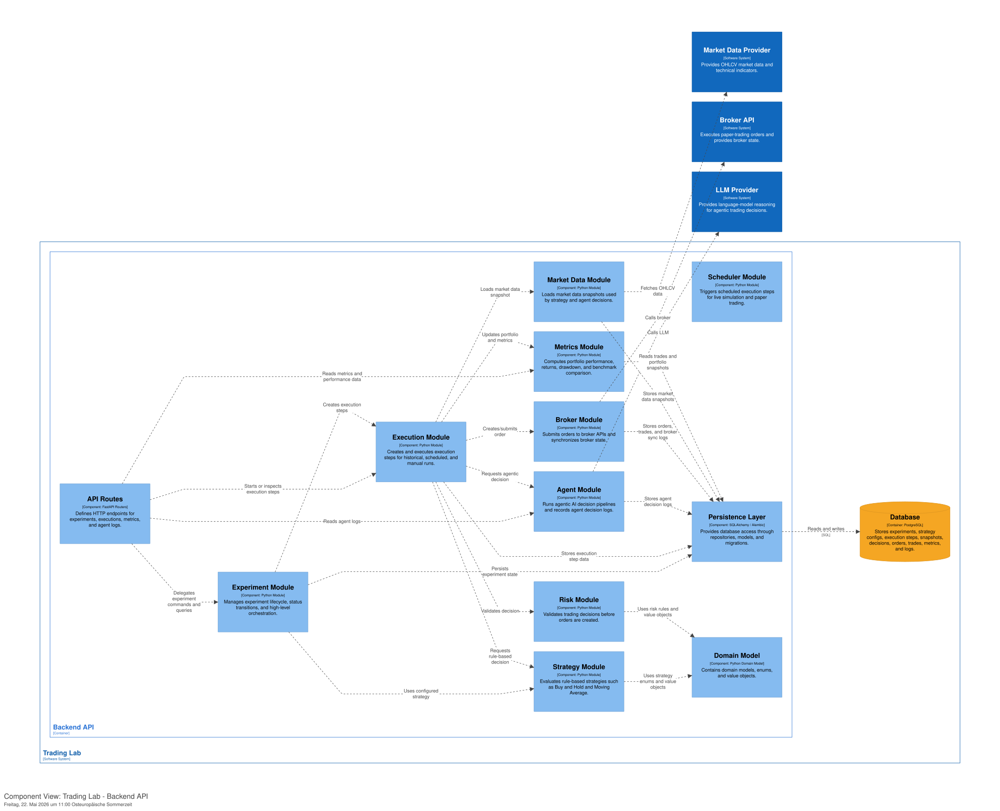
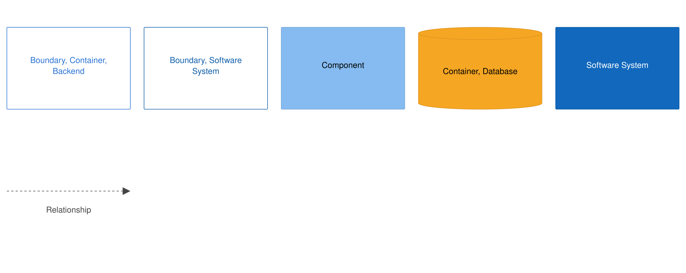

# C4 Component Diagram

## 1. Purpose

This document describes the C4 Level 3 Component view for the `Backend API` container of Trading Lab.

The purpose of this diagram is to show the main internal backend components, their responsibilities, and the dependencies between them.

This document focuses on backend components inside the FastAPI modular monolith. It does not describe frontend components, database table details, or low-level class implementations.

---

## 2. Component Diagram




---

## 3. Backend Container

### Backend API

Technology:

- FastAPI
- Python
- SQLAlchemy
- Alembic
- APScheduler
- httpx

Responsibility:

The Backend API is the core application container. It exposes REST APIs, manages experiment lifecycle, orchestrates execution steps, evaluates strategies and agents, enforces risk rules, executes simulated or paper orders, calculates metrics, and persists all relevant state.

The backend is implemented as a modular monolith. Internal modules must remain clearly separated.

---

## 4. Main Components

The Backend API consists of the following main components:

- API Routes
- Experiment Module
- Scheduler Module
- Execution Module
- Strategy Module
- Agent Module
- Risk Module
- Market Data Module
- Broker Module
- Metrics Module
- Persistence Layer
- Domain Model

---

## 5. API Routes

### Responsibility

The API Routes component defines HTTP endpoints for frontend communication.

It exposes endpoints for:

- experiments
- execution steps
- trades
- orders
- metrics
- portfolio snapshots
- agent logs
- system events
- broker sync logs
- comparison views
- options

### Allowed Dependencies

API Routes may call:

- Experiment Module
- Execution Module
- Metrics Module
- Agent Module
- Persistence-backed query services

### Not Allowed

API Routes must not contain:

- trading logic
- risk logic
- strategy logic
- agent prompt logic
- broker API calls
- direct complex SQL queries
- portfolio calculation logic

### Rule

API Routes validate requests, map DTOs, call application services, and return responses.

They do not implement business logic.

---

## 6. Experiment Module

### Responsibility

The Experiment Module manages experiment lifecycle and high-level experiment state.

It is responsible for:

- creating experiments
- validating experiment configuration
- initializing portfolios
- managing experiment status transitions
- starting experiments
- pausing experiments
- resuming experiments
- stopping experiments
- marking experiments as completed or failed

### Status Model

Supported experiment statuses:

- `CREATED`
- `RUNNING`
- `PAUSED`
- `STOPPED`
- `COMPLETED`
- `FAILED`

### Allowed Dependencies

Experiment Module may call:

- Execution Module
- Persistence Layer
- Domain Model

### Key Rules

- An experiment must be created before it can be started.
- A running experiment may be paused or stopped.
- A paused experiment may be resumed or stopped.
- A completed or stopped experiment must not be restarted in Version 1.
- Invalid status transitions must be rejected.

---

## 7. Scheduler Module

### Responsibility

The Scheduler Module triggers execution steps for running experiments.

It is responsible for:

- scheduling daily, weekly, or monthly execution steps
- triggering live-like simulation steps
- triggering paper-trading steps
- supporting manual run-next-step execution
- preventing concurrent execution for the same experiment

### Technology

- APScheduler in Version 1

### Allowed Dependencies

Scheduler Module may call:

- Experiment Module
- Execution Module
- Persistence Layer

### Key Rules

- The scheduler must not depend on the frontend.
- The scheduler must not execute two concurrent steps for the same experiment.
- Manual and scheduled execution must use the same execution pipeline.
- Historical simulation execution in V1 uses FastAPI in-process background tasks. Manual `run-next-step` uses the same execution pipeline for deterministic debugging and creates exactly one execution step.
- Historical, scheduled, and manual execution must be represented as `ExecutionStep` records.

---

## 8. Execution Module

### Responsibility

The Execution Module is the core orchestration component for running experiment steps.

It is responsible for:

- creating an `ExecutionStep`
- loading market data
- storing `MarketDataSnapshot`
- loading portfolio state
- building execution context
- invoking strategy or agent decision logic
- storing `TradingDecision`
- invoking the Risk Module
- storing `RiskCheck`
- executing approved decisions
- creating orders and trades
- updating portfolio state
- storing portfolio snapshots
- triggering metric calculation
- storing system events

### Core Flow

The Execution Module follows this sequence:

1. Load experiment.
2. Create `ExecutionStep`.
3. Load market data.
4. Store `MarketDataSnapshot`.
5. Load portfolio state.
6. Build strategy or agent context.
7. Request `TradingDecision`.
8. Store `TradingDecision`.
9. Pass decision to Risk Module.
10. Store `RiskCheck`.
11. If final action is `HOLD`, skip order execution.
12. Otherwise execute through simulation or paper-trading provider.
13. Store an `Order` if applicable, and zero or more `Trade` records when fills occur.
14. Update portfolio state.
15. Store `PortfolioSnapshot`.
16. Calculate and store `MetricSnapshot`.
17. Store system events.
18. Mark `ExecutionStep` as completed, skipped, or failed.

### Allowed Dependencies

Execution Module may call:

- Market Data Module
- Strategy Module
- Agent Module
- Risk Module
- Broker Module
- Metrics Module
- Persistence Layer
- Domain Model

### Key Rules

- Execution Module is the only component that coordinates a full execution step.
- Strategies and agents must not execute orders directly.
- Every decision must pass through the Risk Module.
- Every execution step must be persisted and auditable.
- An execution step may create zero or one Order. One Order may create zero, one, or many Trade records.

---

## 9. Strategy Module

### Responsibility

The Strategy Module evaluates rule-based trading strategies.

Version 1 strategies:

- Buy and Hold
- Moving Average
- Agentic AI as a strategy wrapper

Rule-based strategies produce standardized `TradingDecision` objects.

### Strategy Contract

Every strategy must follow this conceptual contract:

```text
decide(context) -> TradingDecision

The strategy context may contain:

- experiment configuration
- strategy configuration
- market data snapshot
- current portfolio state
- previous trades
- current metrics
- execution timestamp

### Allowed Dependencies

Strategy Module may call:

- Domain Model

For Agentic AI strategy, it may delegate to:

- Agent Module

### Not Allowed

Strategy Module must not call:

- Broker Module
- Broker API
- Database directly
- LLM Provider directly, except through Agent Module for Agentic AI
- Execution Module

### Key Rules

- A strategy only decides.
- A strategy does not execute.
- A strategy does not persist state directly.
- A strategy does not bypass risk validation.

---

## 10. Agent Module

### Responsibility

The Agent Module supports agentic-AI trading strategies.

It is responsible for:

- building agent inputs
- building prompts
- calling the LLM provider
- parsing LLM outputs
- validating structured outputs
- running repair prompts for invalid outputs
- creating agent decision logs
- returning standardized `TradingDecision` objects

### Agent Modes

Version 1 supports:

- `SINGLE_AGENT`
- `PIPELINE`

Pipeline mode may include:

- Market Analyst Agent
- Trading Decision Agent
- Agent Risk Manager

The Agent Risk Manager is not the same as the system Risk Module. The system Risk Module remains mandatory and authoritative.

### Allowed Dependencies

Agent Module may call:

- LLM Provider
- Persistence Layer
- Domain Model

### Not Allowed

Agent Module must not call:

- Broker Module
- Broker API
- Execution Module directly
- Database directly outside persistence abstractions
- Alpaca Market Data directly

### Key Rules

- LLM output must never be executed directly.
- LLM output must be parsed and validated.
- Invalid output must trigger a repair attempt.
- If repair fails, the fallback decision is `HOLD`.
- Every agent input, prompt, raw output, parsed output, and repair attempt must be logged.
- Final agent output must become a standardized `TradingDecision`.
- Every agent decision must pass through the system Risk Module.

---

## 11. Risk Module

### Responsibility

The Risk Module validates every `TradingDecision` before execution.

It is responsible for enforcing:

- SPY-only restriction in Version 1
- no real-money trading
- no short selling
- no margin trading
- no selling without position
- no buying without sufficient cash
- maximum position size
- maximum trades per day or week
- max drawdown limit
- fallback `HOLD` on invalid decisions

### Input

The Risk Module receives:

- `TradingDecision`
- portfolio state
- experiment configuration
- risk configuration
- recent trades
- current metrics

### Output

The Risk Module produces a `RiskCheck`.

A `RiskCheck` contains:

- approved flag
- final action
- final quantity
- final notional
- rejection reason
- triggered rules

### Allowed Dependencies

Risk Module may call:

- Domain Model
- Persistence Layer for reading relevant state, if needed

### Not Allowed

Risk Module must not call:

- Broker API
- LLM Provider
- Market Data Provider

### Key Rules

- The Risk Module is mandatory.
- No decision may be executed without a `RiskCheck`.
- The Risk Module is authoritative over agent suggestions.
- Agents may suggest position size, but Risk Module decides final executable size.

---

## 12. Market Data Module

### Responsibility

The Market Data Module provides market data for execution steps.

It is responsible for:

- fetching SPY market data
- fetching historical data
- fetching latest data
- creating market data snapshots
- preparing technical indicator inputs
- handling missing market data

### Version 1 Provider

- Alpaca Market Data

### Allowed Dependencies

Market Data Module may call:

- Market Data Provider
- Persistence Layer
- Domain Model

### Not Allowed

Market Data Module must not call:

- Broker API
- LLM Provider
- Strategy Module
- Agent Module

### Key Rules

- Market data access must be isolated in this module.
- Strategies and agents must receive market data through execution context, not by calling external providers directly.
- Market data used for a decision must be persisted as a `MarketDataSnapshot`.

---

## 13. Broker Module

### Responsibility

The Broker Module encapsulates paper-trading broker integration.

It is responsible for:

- submitting paper orders
- reading broker account state
- reading broker positions
- reading order status
- synchronizing local state with broker state
- creating broker sync logs
- detecting broker-state mismatches

### Version 1 Broker

- Alpaca Paper Trading

### Allowed Dependencies

Broker Module may call:

- Broker API
- Persistence Layer
- Domain Model

### Not Allowed

Broker Module must not be called directly by:

- Strategy Module
- Agent Module
- Frontend

### Key Rules

- Only paper-trading endpoints may be used in Version 1.
- Live-trading endpoints must be blocked.
- In paper-trading mode, broker state is the source of truth.
- If local state and broker state diverge, the experiment must be paused and a broker sync event must be recorded.

---

## 14. Metrics Module

### Responsibility

The Metrics Module calculates performance metrics.

It is responsible for:

- total return
- profit/loss
- number of trades
- max drawdown
- Buy-and-Hold comparison
- metric snapshots

### Inputs

The Metrics Module may use:

- portfolio snapshots
- trades
- experiment configuration
- benchmark experiment data

### Output

The Metrics Module produces `MetricSnapshot` records.

### Allowed Dependencies

Metrics Module may call:

- Persistence Layer
- Domain Model

### Not Allowed

Metrics Module must not call:

- Broker API
- LLM Provider
- Market Data Provider directly

### Key Rules

- Metrics must be recalculated or updated after every execution step.
- Metrics must be reproducible from stored portfolio snapshots and trades.
- Buy-and-Hold benchmark should be represented as its own experiment.

---

## 15. Persistence Layer

### Responsibility

The Persistence Layer provides database access.

It contains:

- SQLAlchemy models
- repositories
- database session management
- Alembic migrations

It persists:

- experiments
- strategy configs
- portfolios
- execution steps
- market data snapshots
- trading decisions
- risk checks
- orders
- trades
- portfolio snapshots
- metric snapshots
- agent decision logs
- broker sync logs
- system event logs

### Allowed Dependencies

Persistence Layer may call:

- Database

### Key Rules

- Business logic should not be implemented in repositories.
- Repositories should encapsulate database access.
- Services should not scatter raw SQL or ORM queries throughout the codebase.
- Database migrations must be documented and reproducible.

---

## 16. Domain Model

### Responsibility

The Domain Model contains shared domain concepts.

It includes:

- enums
- value objects
- domain data structures
- interface definitions
- shared domain validation types

Examples:

- `ExperimentStatus`
- `ExperimentMode`
- `StrategyType`
- `TradingFrequency`
- `Action`
- `OrderStatus`
- `ExecutionStepStatus`
- `TriggerType`
- `AgentMode`
- `TradingDecision`
- `RiskCheckResult`
- `PortfolioState`
- `StrategyContext`

### Key Rules

- Domain concepts must be shared consistently across modules.
- Modules should depend on stable domain abstractions where possible.
- Domain Model must not depend on infrastructure modules such as Broker, Market Data, or Persistence.

---

## 17. Component Relationships

### API Routes

API Routes delegate to:

- Experiment Module for experiment commands and queries
- Execution Module for execution-step operations
- Metrics Module for performance data
- Agent Module or query services for agent logs

### Experiment Module

Experiment Module uses:

- Execution Module to create or start execution flows
- Persistence Layer to persist experiment state
- Domain Model for statuses and value objects

### Execution Module

Execution Module uses:

- Market Data Module for market data snapshots
- Strategy Module for rule-based decisions
- Agent Module for agentic decisions
- Risk Module for validation
- Broker Module for paper-trading execution
- Metrics Module for metric updates
- Persistence Layer for storing all execution-related data

### Agent Module

Agent Module uses:

- LLM Provider for reasoning
- Persistence Layer for logs
- Domain Model for decision structures

### Broker Module

Broker Module uses:

- Broker API for paper orders and broker state
- Persistence Layer for orders, trades, and sync logs

### Metrics Module

Metrics Module uses:

- Persistence Layer for trades, portfolio snapshots, and benchmark data

---

## 18. Critical Design Rules

The following component-level rules must not be violated:

1. API Routes do not contain business logic.
2. Frontend does not call external trading, market data, or LLM providers.
3. Strategies do not execute orders.
4. Agents do not execute orders.
5. Strategies and agents only produce `TradingDecision`.
6. Every `TradingDecision` must pass through the Risk Module.
7. Only the Execution Module creates executable orders.
8. Only the Broker Module communicates with the Broker API.
9. Only the Market Data Module communicates with the Market Data Provider.
10. Only the Agent Module or LLM client abstraction communicates with the LLM Provider.
11. All execution steps must be persisted.
12. Every executed trade must be auditable.
13. Version 1 must not support real-money trading.

---

## 19. Runtime Component Flow

A typical backend execution step follows this internal component flow:

1. Scheduler Module or API Routes triggers execution.
2. Experiment Module validates experiment state.
3. Execution Module creates an `ExecutionStep`.
4. Market Data Module loads market data.
5. Persistence Layer stores `MarketDataSnapshot`.
6. Strategy Module or Agent Module produces a `TradingDecision`.
7. Persistence Layer stores `TradingDecision`.
8. Risk Module validates the decision.
9. Persistence Layer stores `RiskCheck`.
10. Execution Module executes the approved result:
    - via internal simulation, or
    - through Broker Module for paper trading.
11. Persistence Layer stores an `Order` if applicable, and zero or more `Trade` records when fills occur.
12. Metrics Module calculates updated metrics.
13. Persistence Layer stores `PortfolioSnapshot` and `MetricSnapshot`.
14. Persistence Layer stores relevant `SystemEventLog` records.
15. Execution Module marks the `ExecutionStep` as completed, skipped, or failed.

---

## 20. Out of Scope at Component Level

The following components are intentionally not part of Version 1:

- separate AI microservice
- separate worker service
- queue consumer service
- authentication module
- user management module
- payment module
- real-money trading module
- portfolio optimization module
- reinforcement learning module
- options trading module
- tax reporting module

---

## 21. Related Documents

- `./system-overview.md`
- `./c4-context.md`
- `./c4-container.md`
- `./decisions.md`
- `../../02_domain/01_entities.md`
- `../../02_domain/02_workflows.md`
- `../../02_domain/03_business-rules.md`
- `../../04_api/api-spec.md`
- `../../03_database/schema.dbml`
- `../../05_backend/module-structure.md`
- `../../05_backend/service-contracts.md`
