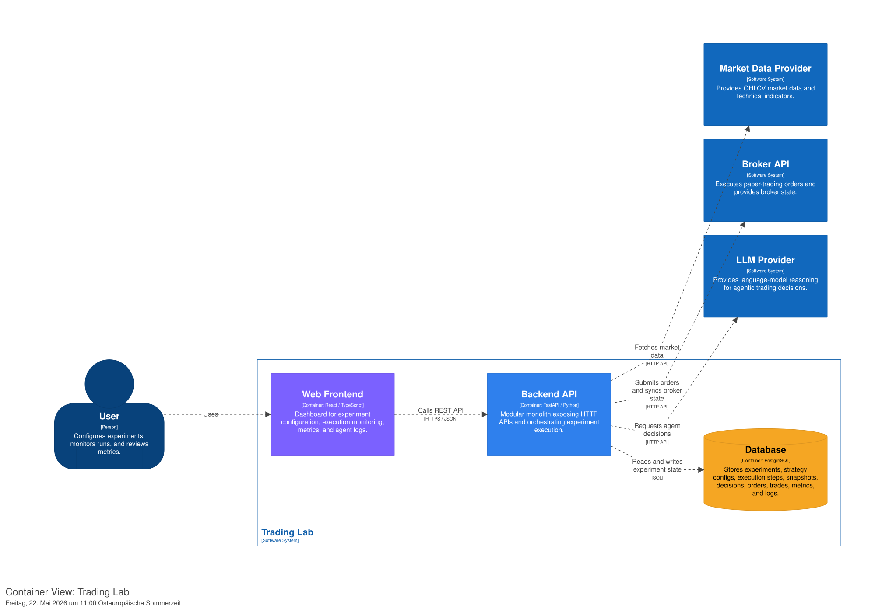
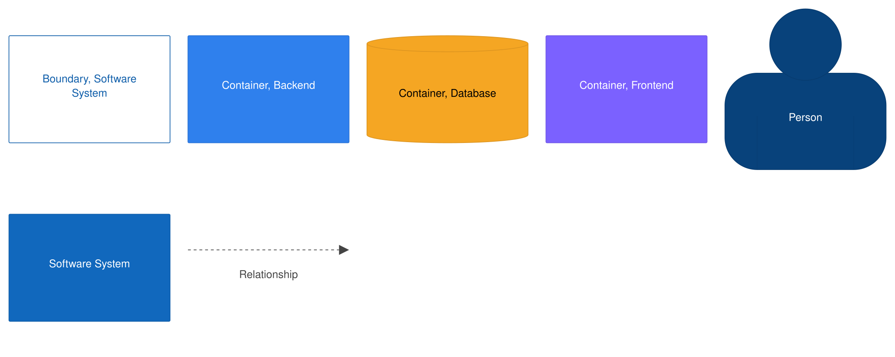

# C4 Container Diagram

## 1. Purpose

This document describes the C4 Level 2 Container view for Trading Lab.

The purpose of this diagram is to show the main deployable and runtime units of the system, their responsibilities, and how they communicate with each other and with external systems.

This document focuses on containers, not internal backend modules or database schema details. Backend components are documented in `c4-component.md`.

---

## 2. Container Diagram

Diagram key:

---

## 3. Containers in Scope

Trading Lab consists of three main containers:

- Web Frontend
- Backend API
- Database

The system also communicates with external systems:

- Market Data Provider
- Broker API
- LLM Provider

---

## 4. Web Frontend

### Technology

React / TypeScript

### Responsibility

The Web Frontend provides the user interface for creating, monitoring, comparing, and inspecting trading experiments.

It is responsible for:

- displaying the dashboard
- creating experiments
- starting, pausing, resuming, and stopping experiments
- displaying experiment detail pages
- displaying portfolio and return charts
- displaying trades, orders, metrics, execution steps, and events
- displaying agent decision logs
- displaying comparison views
- showing integration status in settings

### Communication

The Web Frontend communicates only with the Backend API.

It must not communicate directly with:

- Market Data Provider
- Broker API
- LLM Provider
- Database

### Architectural Rule

The frontend must not contain trading logic, risk logic, broker logic, or agent decision logic.

The frontend is a presentation and interaction layer only.

---

## 5. Backend API

### Technology

FastAPI / Python

### Responsibility

The Backend API is the core application container. It is implemented as a modular monolith.

It owns all application logic, including:

- experiment lifecycle management
- strategy execution
- agentic-AI decision orchestration
- risk validation
- execution orchestration
- internal simulation
- paper-trading orchestration
- market data access
- broker integration
- metrics calculation
- event logging
- database persistence

### Internal Modules

The Backend API contains these internal modules:

- API Routes
- Experiment Module
- Strategy Module
- Agent Module
- Risk Module
- Execution Module
- Market Data Module
- Broker Module
- Metrics Module
- Scheduler Module
- Persistence Layer
- Domain Model

These modules are documented in more detail in `c4-component.md`.

### Communication

The Backend API communicates with:

- Web Frontend via REST API
- Database via SQL
- Market Data Provider via HTTP API
- Broker API via HTTP API
- LLM Provider via HTTP API

### Architectural Rules

The Backend API must enforce these rules:

1. Strategies and agents produce only `TradingDecision` objects.
2. Every `TradingDecision` must pass through the Risk Module.
3. Orders are created only after risk validation.
4. Orders are executed only through the Execution Module.
5. Broker access must go through the Broker Module.
6. Market data access must go through the Market Data Module.
7. LLM access must go through the Agent Module or LLM client abstraction.
8. Real-money trading is not supported in Version 1.

---

## 6. Database

### Technology

PostgreSQL

### Responsibility

The Database stores all persistent system state.

It stores:

- experiments
- strategy configurations
- portfolios
- execution steps
- market data snapshots
- trading decisions
- risk checks
- orders
- trades
- portfolio snapshots
- metric snapshots
- agent decision logs
- broker sync logs
- system event logs

### Data Ownership

The Database is owned by the Backend API.

No other container may access the Database directly.

The Web Frontend must never read from or write to the Database directly.

### Persistence Principles

The database model must support auditability.

Every executed trade should be traceable through:

- Experiment
- ExecutionStep
- MarketDataSnapshot
- TradingDecision
- RiskCheck
- Order
- Trade
- PortfolioSnapshot
- MetricSnapshot

---

## 7. External Systems

## 7.1 Market Data Provider

### Responsibility

The Market Data Provider supplies OHLCV market data and technical indicator inputs.

In Version 1, Alpaca Market Data is the expected provider.

Trading Lab uses market data for:

- historical simulations
- live-like simulations
- paper-trading decisions
- moving average calculation
- RSI calculation
- market data snapshots

### Access Rule

Only the Backend API may call the Market Data Provider.

Within the Backend API, access must be isolated in the Market Data Module.

Strategies and agents must not call the Market Data Provider directly.

---

## 7.2 Broker API

### Responsibility

The Broker API executes paper-trading orders and provides broker state.

In Version 1, Alpaca Paper Trading is the expected broker API.

Trading Lab uses the Broker API for:

- submitting paper orders
- checking order status
- reading broker cash balance
- reading current positions
- synchronizing broker state with local state

### Access Rule

Only the Backend API may call the Broker API.

Within the Backend API, access must be isolated in the Broker Module.

Strategies and agents must not call the Broker API directly.

### Safety Rule

Version 1 must only use paper-trading endpoints.

Live-trading or real-money trading endpoints must not be used.

---

## 7.3 LLM Provider

### Responsibility

The LLM Provider supplies language-model reasoning for agentic-AI trading decisions.

Trading Lab uses the LLM Provider for:

- single-agent decision generation
- pipeline-agent reasoning
- structured BUY / SELL / HOLD outputs
- confidence values
- explanations
- repair prompts for invalid outputs

### Access Rule

Only the Backend API may call the LLM Provider.

Within the Backend API, access must be isolated in the Agent Module or LLM client abstraction.

LLM output must never be executed directly.

Every LLM output must be:

1. logged
2. parsed
3. validated
4. converted into a standardized `TradingDecision`
5. passed through the Risk Module before execution

---

## 8. Container Relationships

## 8.1 User → Web Frontend

The user interacts with the Trading Lab through the Web Frontend.

The user can:

- create experiments
- configure strategies
- start, pause, resume, and stop experiments
- inspect dashboards
- compare experiments
- inspect trades, metrics, logs, and agent decisions

---

## 8.2 Web Frontend → Backend API

The Web Frontend calls the Backend API through REST endpoints.

Communication format:

- HTTPS
- JSON

Typical endpoints:

- create experiment
- list experiments
- get experiment detail
- start experiment
- pause experiment
- resume experiment
- stop experiment
- run next execution step
- fetch metrics
- fetch trades
- fetch agent logs
- compare experiments

The Web Frontend uses polling for dashboard updates.

---

## 8.3 Backend API → Database

The Backend API reads and writes experiment state through the Persistence Layer.

Communication format:

- SQL
- SQLAlchemy ORM
- Alembic migrations

The Backend API is the only container allowed to access the Database.

---

## 8.4 Backend API → Market Data Provider

The Backend API fetches market data through the Market Data Module.

Used for:

- historical simulation
- scheduled live-like simulation
- paper-trading decision inputs
- market data snapshots

---

## 8.5 Backend API → Broker API

The Backend API communicates with the Broker API through the Broker Module.

Used for:

- submitting paper orders
- retrieving account state
- retrieving positions
- retrieving order status
- detecting broker-state mismatches

If local state and broker state diverge, the system must pause the affected experiment and record a broker sync event.

---

## 8.6 Backend API → LLM Provider

The Backend API calls the LLM Provider through the Agent Module.

Used for:

- generating agentic-AI decisions
- generating intermediate pipeline-agent outputs
- repairing invalid structured outputs

All LLM interactions must be logged for auditability.

---

## 9. Runtime Execution Flow Across Containers

A typical experiment execution crosses containers as follows:

1. User starts an experiment in the Web Frontend.
2. Web Frontend calls the Backend API.
3. Backend API updates experiment state in the Database.
4. Scheduler or manual trigger starts an execution step.
5. Backend API fetches market data from the Market Data Provider.
6. Backend API creates a MarketDataSnapshot in the Database.
7. Backend API runs the selected strategy or agent.
8. If the strategy is agentic, Backend API calls the LLM Provider.
9. Backend API stores the TradingDecision.
10. Backend API passes the decision through the Risk Module.
11. Backend API stores the RiskCheck.
12. Backend API executes the approved decision:
    - internally through simulation, or
    - externally through the Broker API for paper trading.
13. Backend API stores Order and Trade records if applicable.
14. Backend API updates Portfolio and PortfolioSnapshot.
15. Backend API calculates and stores MetricSnapshot.
16. Web Frontend polls the Backend API for updated state.

---

## 10. Deployment View for Version 1

Version 1 is designed to run locally through Docker Compose.

Expected services:

- frontend
- backend
- postgres

Optional local development services:

- pgAdmin
- adminer

The local deployment must use environment variables for secrets and configuration.

The `.env` file must not be committed.

Only `.env.example` may be committed.

---

## 11. Container-Level Architectural Rules

The following rules must be preserved during implementation:

1. The Web Frontend must call only the Backend API.
2. The Web Frontend must not contain trading, risk, broker, or LLM logic.
3. The Backend API owns all business logic.
4. The Database must only be accessed by the Backend API.
5. Market data access must be isolated behind the Market Data Module.
6. Broker access must be isolated behind the Broker Module.
7. LLM access must be isolated behind the Agent Module or LLM client abstraction.
8. Strategies and agents must not execute orders directly.
9. Every decision must pass through the Risk Module before execution.
10. Version 1 must not support real-money trading.

---

## 12. Out of Scope at Container Level

The following containers or deployment units are intentionally not part of Version 1:

- separate AI microservice
- separate worker service
- message broker
- Redis queue
- Kubernetes deployment
- authentication service
- user management service
- mobile app
- public API gateway
- real-money trading broker integration

These may be considered in later versions if system requirements justify the additional complexity.

---

## 13. Related Documents

- `./system-overview.md`
- `./c4-context.md`
- `./c4-component.md`
- `./decisions.md`
- `../02_domain/entities.md`
- `../02_domain/workflows.md`
- `../02_domain/business-rules.md`
- `../03_api/api-spec.md`
- `../04_database/schema.dbml`
- `../06_backend/module-structure.md`
- `../06_backend/service-contracts.md`