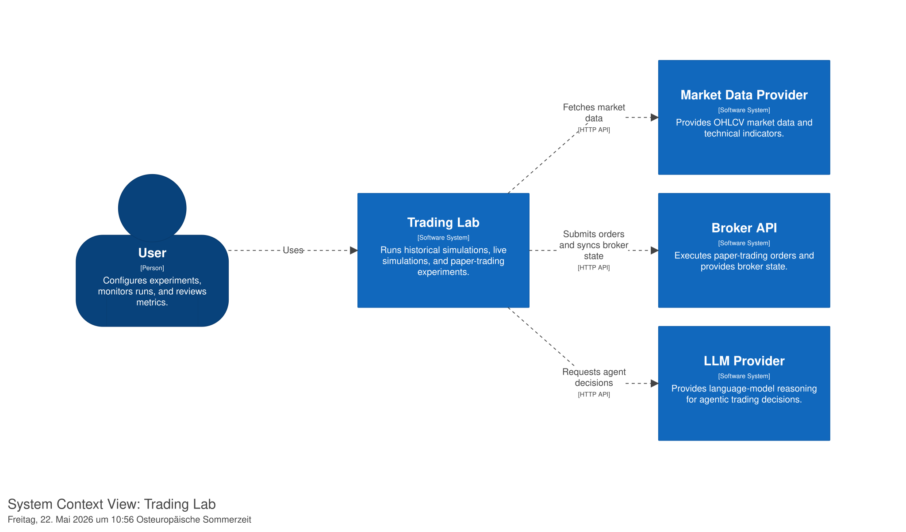

# C4 Context Diagram

## 1. Purpose

This document describes the C4 Level 1 System Context view for Trading Lab.

The purpose of this diagram is to show Trading Lab as a system in its environment. It identifies the primary user, external systems, and the high-level relationships between them.

This document does not describe internal containers, backend modules, database tables, API endpoints, or implementation details. Those are documented in the corresponding container, component, API, and database documents.

---

## 2. System Context Diagram

Diagram key:

---

## 3. System in Scope

### Trading Lab

Trading Lab is a web-based strategy and agentic-AI trading experimentation platform.

It supports:

- historical simulations
- live-like simulations
- paper-trading experiments
- rule-based strategies
- agentic-AI strategies
- portfolio tracking
- performance evaluation
- comparison against Buy-and-Hold benchmarks

Trading Lab is not a financial advisory system and does not support real-money trading in Version 1.

---

## 4. Primary User

### User

The user configures experiments, starts and monitors experiment runs, reviews strategy performance, and inspects metrics, trades, logs, and agent decisions.

Main user responsibilities:

- create trading experiments
- configure strategy parameters
- start, pause, resume, or stop experiments
- inspect performance metrics
- compare experiments
- review agentic-AI decision logs
- diagnose failed or paused runs

The system is designed for a technical or research-oriented user, not for non-technical consumer investing.

---

## 5. External Systems

### Market Data Provider

The Market Data Provider supplies market data used by Trading Lab.

In Version 1, the primary market data provider is expected to be Alpaca Market Data.

Trading Lab uses market data for:

- historical simulations
- live-like simulations
- paper-trading decision inputs
- market data snapshots
- technical indicators such as moving averages and RSI

Trading Lab must persist the market data snapshots used for each execution step so that trading decisions remain auditable.

---

### Broker API

The Broker API executes paper-trading orders and provides broker account state.

In Version 1, the broker integration is expected to use Alpaca Paper Trading.

Trading Lab uses the Broker API for:

- submitting paper orders
- reading broker cash balance
- reading current positions
- reading order status
- synchronizing local state with broker state

The system must only use paper-trading endpoints in Version 1.

Real-money trading endpoints are out of scope and must not be used.

---

### LLM Provider

The LLM Provider supplies language-model reasoning for agentic-AI trading decisions.

Trading Lab uses the LLM Provider for:

- single-agent trading decisions
- pipeline-agent intermediate reasoning
- structured BUY / SELL / HOLD outputs
- agent explanations
- confidence values
- optional repair prompts for invalid outputs

LLM outputs must never be executed directly.

Every LLM-generated decision must be parsed, validated, converted into a standardized TradingDecision, and passed through the Risk Engine before any simulated or paper-trading execution occurs.

---

## 6. Context Relationships

### User → Trading Lab

The user interacts with Trading Lab through the web application.

Typical interactions:

- create an experiment
- configure a strategy
- start or stop an experiment
- inspect dashboard metrics
- compare strategy performance
- inspect agent decision logs

---

### Trading Lab → Market Data Provider

Trading Lab fetches market data from the Market Data Provider.

The fetched data is used to create MarketDataSnapshots for experiment execution steps.

The Market Data Provider is external to Trading Lab and must be accessed only through the Market Data Module.

---

### Trading Lab → Broker API

Trading Lab submits paper-trading orders and synchronizes broker state through the Broker API.

The Broker API is external to Trading Lab and must be accessed only through the Broker Module.

Strategies and agents must not call the Broker API directly.

---

### Trading Lab → LLM Provider

Trading Lab requests agentic-AI reasoning from the LLM Provider.

The LLM Provider is external to Trading Lab and must be accessed only through the Agent Module or the LLM client abstraction.

LLM responses must be logged and validated before being converted into trading decisions.

---

## 7. System Boundary

Trading Lab owns:

- experiment lifecycle
- strategy configuration
- execution orchestration
- market data snapshots
- strategy and agent decisions
- risk checks
- simulated order execution
- paper-trading orchestration
- portfolio state
- metrics
- logs
- audit trail

Trading Lab does not own:

- external market data infrastructure
- broker infrastructure
- LLM model infrastructure
- real-money brokerage execution
- user bank accounts
- financial advisory workflows

---

## 8. Key Architectural Rules

The following rules apply at the system-context level:

1. Trading Lab must not support real-money trading in Version 1.
2. Trading Lab must only use paper-trading broker endpoints.
3. Market data access must be isolated behind the Market Data Module.
4. Broker access must be isolated behind the Broker Module.
5. LLM access must be isolated behind the Agent Module or LLM client abstraction.
6. Strategies and agents must never execute orders directly.
7. Every strategy or agent decision must become a standardized TradingDecision.
8. Every TradingDecision must pass through the Risk Engine before execution.
9. Every executed trade must be auditable from market data input to decision, risk check, order, trade, portfolio snapshot, and metrics.

---

## 9. Version 1 Context Scope

Version 1 includes:

- one user
- one tradable asset: SPY
- one web frontend
- one FastAPI backend
- one PostgreSQL database
- Alpaca Market Data integration
- Alpaca Paper Trading integration
- LLM provider integration
- internal simulation mode
- paper-trading mode
- agentic-AI strategy mode

Version 1 excludes:

- real-money trading
- mobile app
- multi-user support
- user registration
- trading individual S&P 500 stocks
- multi-asset portfolio management
- short selling
- margin trading
- options trading
- high-frequency trading
- tax reporting
- public financial advice

---

## 10. Related Documents

- `./system-overview.md`
- `./c4-container.md`
- `./c4-component.md`
- `./decisions.md`
- `../../02_domain/01_entities.md`
- `../../02_domain/02_workflows.md`
- `../../02_domain/03_business-rules.md`
- `../../04_api/api-spec.md`
- `../../03_database/schema.dbml`
- `../../05_backend/service-contracts.md`